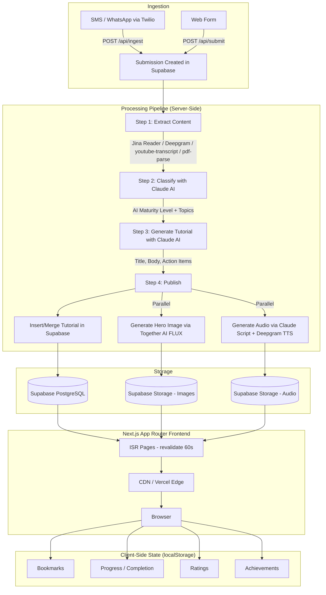
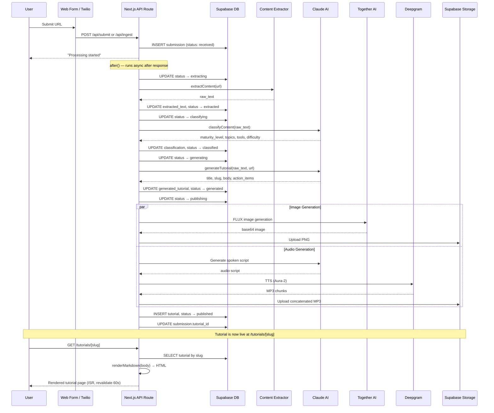
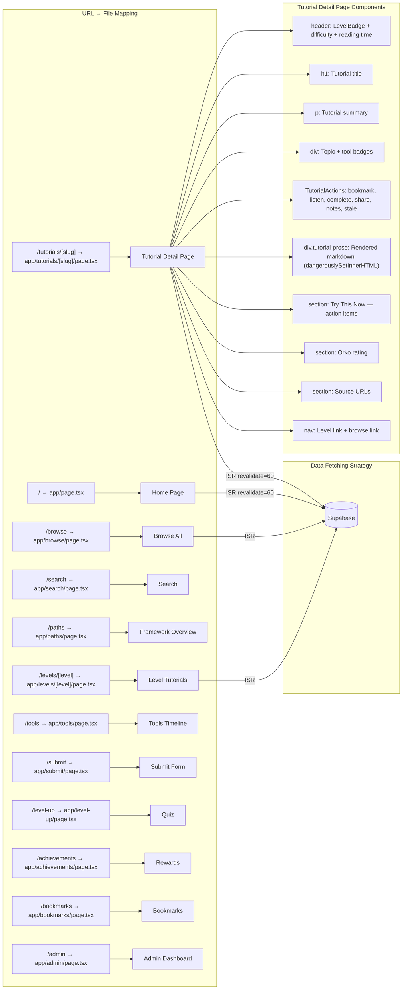
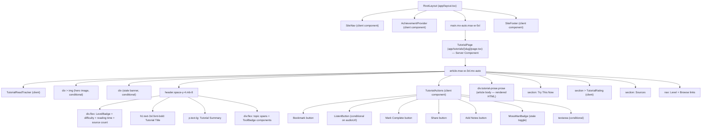

# Battlecat AI — Architecture Document

## Section 1: System Overview

Battlecat AI is an AI-powered learning platform that converts links from various sources (TikTok, YouTube, articles, tweets, PDFs, LinkedIn posts) into structured, step-by-step tutorials organized around an "AI Maturity Framework" with five levels (L0 Asker through L4 Architect). Users submit links via a web form or SMS/WhatsApp (powered by Twilio), and a server-side pipeline extracts content, classifies it against the maturity framework using Claude AI, generates a polished tutorial, creates hero images and audio narration, and publishes the result. The frontend is a Next.js 16 App Router application styled with Tailwind CSS v4, backed by Supabase (PostgreSQL + Storage) for persistence, with a localStorage-based gamification/achievement system themed around He-Man's Castle Grayskull.

## Section 2: Technology Stack

The application is built on **Next.js 16** (App Router, React 19) using **TypeScript** with strict mode enabled. Styling uses **Tailwind CSS v4** with the `@tailwindcss/typography` plugin for rendered markdown prose, configured through PostCSS — there are no custom Tailwind config files; all theme tokens are defined as CSS custom properties in `globals.css` using the `@theme inline` directive. The data layer is **Supabase** (PostgreSQL database plus object storage for images and audio), accessed via the `@supabase/supabase-js` client with separate public and service-role clients for browser and server contexts respectively. AI processing uses the **Anthropic Claude API** (`@anthropic-ai/sdk`, model `claude-sonnet-4-20250514`) for content classification, tutorial generation, audio script writing, and hot news blurb generation. Content extraction leverages **Jina Reader** for articles, **Deepgram** for TikTok/audio transcription and text-to-speech, **youtube-transcript** for YouTube captions, and **pdf-parse** for PDF documents. Image generation uses **Together AI's FLUX model**. SMS/WhatsApp ingestion uses **Twilio** webhooks. The build tooling is Next.js's built-in bundler (Turbopack in dev, Webpack in production). Testing uses **Vitest** with **jsdom**, **@testing-library/react**, and **@testing-library/jest-dom**. Markdown rendering is handled by the **marked** library (GFM mode).

## Section 3: Directory Structure Map

```
battlecat/battlecat/                 # Next.js application root
├── src/
│   ├── app/                         # Next.js App Router — all routes
│   │   ├── layout.tsx               # Root layout: SiteNav + AchievementProvider + SiteFooter
│   │   ├── page.tsx                 # Home page: hero, hot news, latest tutorials, framework overview
│   │   ├── globals.css              # CSS custom properties (color palette), Tailwind config, prose styles
│   │   ├── not-found.tsx            # Custom 404 page
│   │   ├── feed.xml/route.ts        # RSS feed (dynamic route handler)
│   │   ├── tutorials/[slug]/        # Individual tutorial page (THE article page)
│   │   │   ├── page.tsx             # Tutorial detail: header, body (rendered markdown), actions, rating
│   │   │   └── loading.tsx          # Skeleton loading state
│   │   ├── browse/                  # Browse all tutorials with filtering
│   │   ├── search/                  # Full-text search
│   │   ├── paths/                   # AI Maturity Framework overview
│   │   ├── levels/[level]/          # Tutorials filtered by maturity level
│   │   ├── tools/                   # Tools timeline page
│   │   ├── submit/                  # Web form for submitting links
│   │   ├── level-up/                # Interactive quiz to find your level
│   │   ├── achievements/            # Gamification rewards page
│   │   ├── bookmarks/               # User's bookmarked tutorials
│   │   ├── admin/                   # Admin dashboard (pipeline + tutorial management)
│   │   └── api/                     # API route handlers
│   │       ├── submit/route.ts      # POST /api/submit — web form submission
│   │       ├── ingest/route.ts      # POST /api/ingest — Twilio SMS/WhatsApp webhook
│   │       ├── process/route.ts     # POST /api/process — manual pipeline trigger
│   │       ├── tutorials/           # Tutorial CRUD API
│   │       ├── admin/               # Admin API (submissions, tutorials, retry-all)
│   │       ├── tts/[slug]/          # Text-to-speech serving
│   │       ├── research-tools/      # Research agent tools
│   │       └── debug/               # Debug/health endpoints
│   ├── components/                  # Reusable React components
│   │   ├── SiteNav.tsx              # Global navigation bar + footer (client component)
│   │   ├── MobileNav.tsx            # Hamburger menu for mobile
│   │   ├── TutorialCard.tsx         # Tutorial preview card (used on browse, home, levels)
│   │   ├── TutorialActions.tsx      # Bookmark, complete, share, notes, listen, stale buttons
│   │   ├── TutorialRating.tsx       # Orko rating component (1-5 scale)
│   │   ├── TutorialReadTracker.tsx  # Tracks tutorial reads for achievements
│   │   ├── ListenButton.tsx         # Audio playback with MediaSession API integration
│   │   ├── LevelBadge.tsx           # Colored maturity level badge
│   │   ├── ToolBadge.tsx            # Tool name badge with icon
│   │   ├── ImpactScoreBadge.tsx     # Impact score display
│   │   ├── FilterBar.tsx            # Filter controls for browse page
│   │   ├── Skeleton.tsx             # Loading skeleton component
│   │   ├── DarkModeToggle.tsx       # Dark mode class toggler
│   │   ├── HotNews.tsx              # Hot news ticker/carousel
│   │   ├── ToolsTimeline.tsx        # Tools timeline visualization
│   │   ├── AchievementProvider.tsx  # React Context wrapping achievement evaluation
│   │   ├── SorceressModal.tsx       # Achievement unlock celebration modal
│   │   ├── MossManBadge.tsx         # "Stale" content indicator
│   │   ├── OrkoRating.tsx           # Orko character SVG rating
│   │   ├── RecommendedNext.tsx      # "Up next" tutorial recommendations
│   │   └── __tests__/              # Component tests
│   ├── hooks/                       # Custom React hooks (all localStorage-backed)
│   │   ├── useBookmarks.ts          # Bookmark toggle/query
│   │   ├── useProgress.ts           # Tutorial completion + notes
│   │   ├── useRatings.ts            # Orko rating storage
│   │   ├── useAchievements.ts       # Achievement state management
│   │   └── useImpactScore.ts        # Impact score calculation
│   ├── lib/                         # Server-side utilities and business logic
│   │   ├── supabase.ts              # Supabase client factory (public + service role)
│   │   ├── ai.ts                    # Claude AI: classify, generate tutorial, merge, hot news
│   │   ├── extract.ts               # Content extraction (articles, TikTok, YouTube, tweets, PDFs, LinkedIn)
│   │   ├── pipeline.ts              # Resumable pipeline engine (state machine)
│   │   ├── pipeline-steps.ts        # Individual pipeline step implementations
│   │   ├── pipeline-errors.ts       # Error classification (transient vs permanent)
│   │   ├── markdown.ts              # Markdown → HTML rendering via marked
│   │   ├── generate-image.ts        # Hero image generation (Together AI FLUX)
│   │   ├── generate-audio.ts        # TTS pipeline (Claude script → Deepgram Aura-2)
│   │   ├── impact-score.ts          # Impact score calculation
│   │   ├── research-agent.ts        # Research agent utilities
│   │   └── __tests__/              # Library tests
│   ├── config/                      # Static configuration
│   │   ├── brand.ts                 # Brand name, tagline, color palette
│   │   ├── levels.ts                # AI Maturity Framework level definitions (L0-L4)
│   │   ├── achievements.ts          # Achievement definitions (He-Man/Grayskull themed)
│   │   ├── tools.ts                 # AI tool definitions
│   │   ├── tool-icons.ts            # Tool icon mappings
│   │   ├── hot-news.ts              # Manual hot news config entries
│   │   └── quiz.ts                  # Level-up quiz questions
│   ├── data/                        # Data access layer
│   │   ├── tutorials.ts             # Tutorial queries (Supabase + seed fallback)
│   │   ├── seed-tutorials.ts        # Hardcoded seed tutorials for dev/demo
│   │   └── tts/                     # Pre-generated TTS audio + text files
│   ├── db/                          # Database schema
│   │   ├── schema.sql               # Main Supabase schema (submissions, tutorials, sources, user_progress)
│   │   └── migrations/              # Incremental migrations
│   └── types/
│       └── index.ts                 # TypeScript type definitions (Tutorial, Submission, etc.)
├── public/                          # Static assets
├── package.json                     # Dependencies and scripts
├── tsconfig.json                    # TypeScript config (paths: @/* → ./src/*)
├── vitest.config.ts                 # Vitest test configuration
├── postcss.config.mjs               # PostCSS with Tailwind CSS plugin
├── eslint.config.mjs                # ESLint with Next.js + TypeScript rules
└── next.config.ts                   # Next.js configuration (minimal)
```

## Section 4: Architecture Diagram — System Overview



## Section 5: Content Pipeline Diagram



## Section 6: Routing & Page Architecture



## Section 7: Component Hierarchy for Article Pages



## Section 8: Key Files Reference

| File | Role |
|------|------|
| `src/app/tutorials/[slug]/page.tsx` | **Article page route** — renders individual tutorials (the target for Mission 2) |
| `src/app/layout.tsx` | Root layout: `<SiteNav>` + `<AchievementProvider>` + `<main>` + `<SiteFooter>` |
| `src/app/page.tsx` | Home page: hero section, hot news, latest tutorials, framework overview |
| `src/app/globals.css` | Design tokens (CSS custom properties), Tailwind theme, `.tutorial-prose` styles |
| `src/components/TutorialActions.tsx` | Client component: bookmark, complete, share, notes, listen buttons |
| `src/components/SiteNav.tsx` | Global nav bar and footer |
| `src/components/TutorialCard.tsx` | Tutorial preview card used across listing pages |
| `src/components/ListenButton.tsx` | Audio playback with MediaSession (pattern reference for the copy button) |
| `src/lib/markdown.ts` | `renderMarkdown()` — converts tutorial body markdown to HTML via `marked` |
| `src/lib/ai.ts` | Claude AI integration: classify, generate, merge, hot news blurb |
| `src/lib/extract.ts` | Content extraction dispatcher (articles, TikTok, YouTube, tweets, PDFs, LinkedIn) |
| `src/lib/pipeline.ts` | Resumable pipeline engine (state machine with retry logic) |
| `src/lib/pipeline-steps.ts` | Individual pipeline step implementations (extract, classify, generate, publish) |
| `src/lib/supabase.ts` | Supabase client factory (public + service role) |
| `src/data/tutorials.ts` | Data access layer: queries Supabase with seed data fallback |
| `src/types/index.ts` | Core TypeScript types: `Tutorial`, `Submission`, `MaturityLevel`, etc. |
| `src/config/levels.ts` | AI Maturity Framework level definitions (L0-L4) |
| `src/config/brand.ts` | Brand name, colors, tagline |
| `src/config/achievements.ts` | Achievement definitions (He-Man/Grayskull themed gamification) |
| `src/hooks/useBookmarks.ts` | localStorage-backed bookmarks hook |
| `src/hooks/useProgress.ts` | localStorage-backed progress tracking hook |
| `src/db/schema.sql` | Supabase database schema (submissions, tutorials, sources, user_progress) |

## Section 9: Patterns & Conventions

**Import paths** use the `@/*` alias mapped to `./src/*` (configured in `tsconfig.json`). All imports are absolute from `@/`.

**Component architecture** follows the Next.js App Router pattern: page-level components are async server components that fetch data and pass it down. Interactive UI uses `"use client"` components. The convention is to mark client components at the component file level, not at the page level.

**Styling** is Tailwind CSS v4 utility-first. The project defines a custom color palette via CSS custom properties (`--bc-primary`, `--bc-secondary`, `--bc-surface`, `--bc-border`, `--bc-text-secondary`, etc.) exposed to Tailwind through `@theme inline` in `globals.css`. Components use classes like `bg-bc-primary`, `text-bc-text-secondary`, `border-bc-border`. Dark mode is class-based (`.dark` on `<html>`).

**Button styling pattern**: action buttons use `inline-flex items-center gap-1.5 rounded-lg border px-3 py-2 text-sm font-medium transition-colors` with state-dependent border and text colors. The `TutorialActions.tsx` and `ListenButton.tsx` components are the canonical references.

**State management**: all user state (bookmarks, progress, ratings, achievements) is stored in `localStorage` via custom hooks (`useBookmarks`, `useProgress`, `useRatings`, `useAchievements`). Each hook follows the same pattern: `useState` with default → `useEffect` to hydrate from `localStorage` on mount → `useEffect` to persist on change. A `loaded` flag prevents hydration mismatches.

**Data fetching**: tutorial pages use ISR with `revalidate = 60`. The data layer (`src/data/tutorials.ts`) tries Supabase first and falls back to hardcoded seed data. This makes the app work without a database connection during development.

**Naming conventions**: files use kebab-case (`pipeline-steps.ts`), components use PascalCase (`TutorialCard.tsx`), hooks use camelCase (`useBookmarks.ts`). Config files use kebab-case.

**No authentication**: the app is currently anonymous. User state is localStorage-only. The admin page uses a shared secret passed as a query parameter.

**SVG icons**: icons are inline SVGs (no icon library). The convention is Heroicons-style: 24x24 viewBox, `stroke="currentColor"`, `strokeWidth={2}`, `fill="none"`.

**Markdown rendering**: tutorial bodies are stored as raw Markdown in the database. The `renderMarkdown()` function in `src/lib/markdown.ts` converts them to HTML using `marked` (GFM mode). The HTML is injected via `dangerouslySetInnerHTML` into a `div.tutorial-prose.prose` element with extensive Tailwind Typography customization.

## Section 10: Mission 2 Implementation Notes

### Files to Modify

1. **`src/app/tutorials/[slug]/page.tsx`** — Add the Copy-to-Markdown button to the article header area, inside the `<header>` element, next to the `<h1>` title. This is the only existing file that needs modification.

### Files to Create

2. **`src/components/CopyMarkdownButton.tsx`** — New client component for the button with "Copy as Markdown" / "Copied!" states.
3. **`src/lib/articleToMarkdown.ts`** — New utility function for DOM → Markdown conversion.
4. **`src/lib/copyToClipboard.ts`** — New clipboard utility with modern API + fallback.

### Article Header Structure

The article title lives inside `<header className="space-y-4 mb-8">` at line 85 of `page.tsx`. The `<h1>` is at line 105. The button should be placed in a flex container wrapping the `<h1>` to allow right-alignment. The header structure is:

```
<header class="space-y-4 mb-8">
  <div> <!-- badge row: LevelBadge + difficulty + reading time -->
  <h1>  <!-- Tutorial title — button goes inline here -->
  <p>   <!-- Summary -->
  <div> <!-- Topic/tool badges -->
</header>
```

### Article Body Selector

The article body is rendered in a `<div>` with class `tutorial-prose` (line 139-153). This is the element that the Markdown conversion function needs to target. The selector `".tutorial-prose"` or `"article .tutorial-prose"` will work. Additionally, the raw Markdown is already available as `tutorial.body` — however, for the "Copy as Markdown" feature, we should use the rendered DOM to capture exactly what the user sees, including any post-processing.

**Alternative approach**: Since the tutorial body is stored as raw Markdown in `tutorial.body` and rendered via `renderMarkdown()`, we could pass the raw markdown directly to the clipboard instead of reverse-engineering it from the DOM. This is simpler and produces cleaner output. However, the prompt specifies DOM-based conversion, so we'll implement that — but we can also prepend metadata using the `tutorial` object data.

### Existing Clipboard Utilities

The `TutorialActions.tsx` component already uses `navigator.clipboard.writeText()` for the Share button (line 52), with a 2-second "Copied!" timeout pattern (line 53-54). This is the exact UX pattern we need to replicate.

### Existing Icon Components

No icon library is used. All icons are inline SVGs following the Heroicons pattern. A clipboard/document icon SVG will need to be created inline, consistent with the existing 24x24 viewBox, `stroke="currentColor"`, `strokeWidth={2}` convention.

### CSS Approach

The button should use the same pattern as buttons in `TutorialActions.tsx`: `inline-flex items-center gap-1.5 rounded-lg border px-3 py-2 text-sm font-medium transition-colors` with `border-bc-border text-bc-text-secondary hover:border-bc-primary hover:text-bc-primary` for the default state, and a success state using `border-bc-success bg-bc-success/10 text-bc-success` for the "Copied!" feedback.

### Key Decisions

- The button is a `"use client"` component (needs `useState`, `useEffect`, clipboard API).
- It renders inside the server component `TutorialPage` — pass title, body markdown, and metadata as props.
- The DOM selector for conversion is `.tutorial-prose`.
- The function should prepend the title as an `# h1` and add metadata as HTML comments.
- The button should be visually consistent with the existing action buttons but placed in the header area for discoverability.

## Section 11: Copy-to-Markdown Feature

### Files Created

| File | Purpose |
|------|---------|
| `src/components/CopyMarkdownButton.tsx` | Client component — "Copy as Markdown" button with default and "Copied!" states |
| `src/lib/articleToMarkdown.ts` | DOM → Markdown conversion utility |
| `src/lib/copyToClipboard.ts` | Clipboard utility with modern API + legacy fallback |

### Files Modified

| File | Change |
|------|--------|
| `src/app/tutorials/[slug]/page.tsx` | Added import for `CopyMarkdownButton`; wrapped `<h1>` in a flex container with the button right-aligned alongside the title |

### Component API

**`<CopyMarkdownButton>`**

| Prop | Type | Description |
|------|------|-------------|
| `bodySelector` | `string` | CSS selector for the article body container (e.g., `".tutorial-prose"`) |
| `title` | `string` | Tutorial title — prepended as `# title` in the output |
| `meta` | `object?` | Optional metadata: `date`, `author`, `tags`, `level`, `difficulty` — prepended as HTML comments |

**`articleToMarkdown(source, meta?)`**

| Param | Type | Description |
|-------|------|-------------|
| `source` | `string \| HTMLElement` | CSS selector or element for the article body |
| `meta` | `object?` | Metadata to prepend (title, date, tags, level, difficulty) |
| Returns | `Promise<string>` | The converted Markdown |

**`copyToClipboard(text)`**

| Param | Type | Description |
|-------|------|-------------|
| `text` | `string` | Text to copy |
| Returns | `Promise<boolean>` | `true` on success, `false` on failure. Never throws. |

### Markdown Conversion Rules

| HTML Element | Markdown Output |
|-------------|-----------------|
| `h1`–`h6` | `#` through `######` with blank lines |
| `p` | Paragraph text with blank line after |
| `strong`, `b` | `**text**` |
| `em`, `i` | `*text*` |
| `code` (inline) | `` `text` `` |
| `pre > code` | Fenced code block with language from `class="language-xxx"` |
| `a` | `[text](absolute-href)` |
| `img` | `` |
| `ul > li` | `- item` (with nesting via indentation) |
| `ol > li` | `1. item` (auto-incrementing) |
| `blockquote` | `> text` (each line prefixed) |
| `hr` | `---` |
| `table` | GFM table with header separator row |

### Elements Excluded from Conversion

`nav`, `aside`, `footer`, `.comments`, `.share-buttons`, `.related-posts`, `[data-noexport]`, `script`, `style`, `[aria-hidden="true"]`

### Browser Compatibility

- **Primary**: `navigator.clipboard.writeText()` — Chrome 66+, Firefox 63+, Safari 13.1+, Edge 79+
- **Fallback**: `document.execCommand('copy')` — all browsers including IE
- **SSR**: Button is hidden during server-side rendering; only appears after client-side hydration confirms clipboard availability

### Extending the Exclusion List

To exclude additional elements from the Markdown conversion, add CSS selectors to the `EXCLUDE_SELECTORS` array in `src/lib/articleToMarkdown.ts`. Any valid CSS selector works — class names, data attributes, element types, or attribute selectors.
